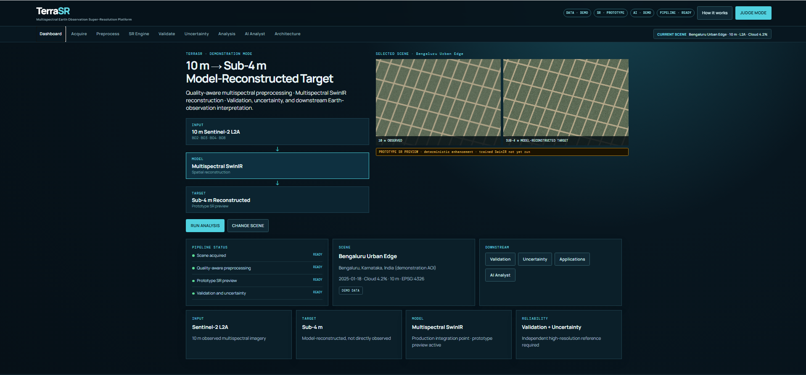
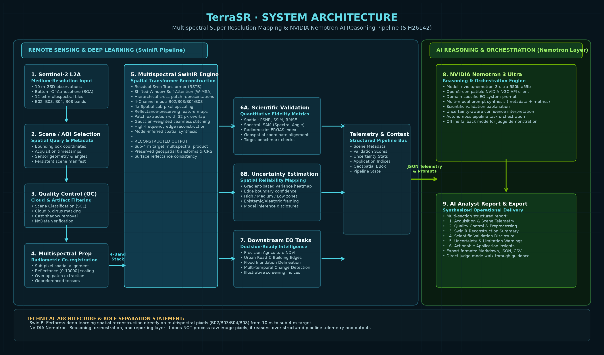
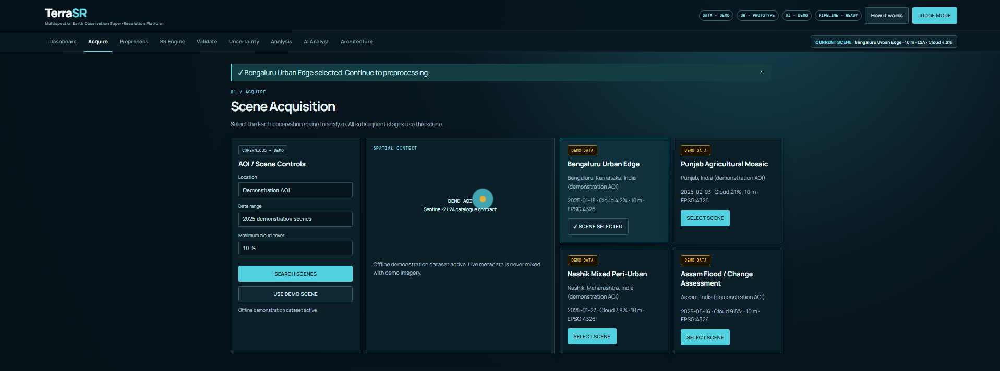
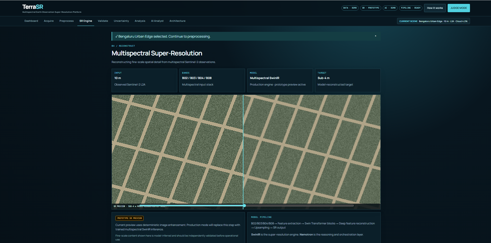
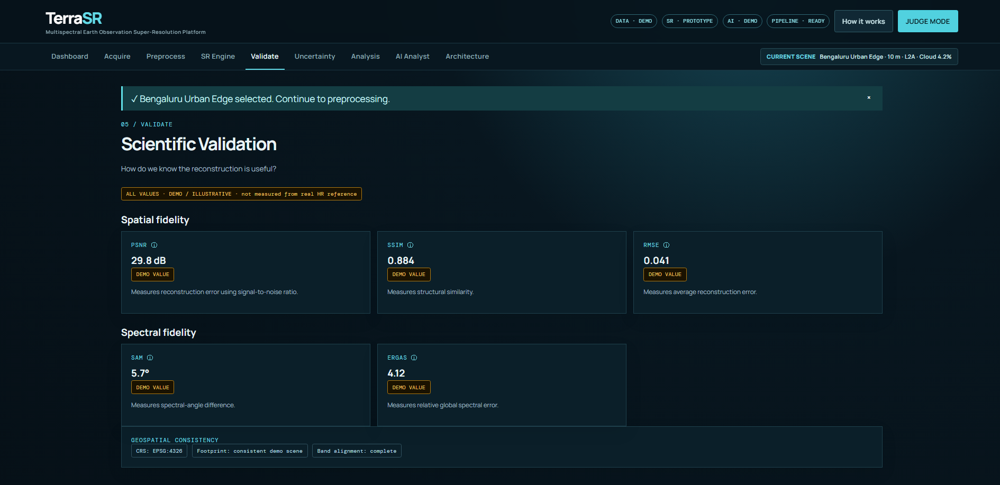
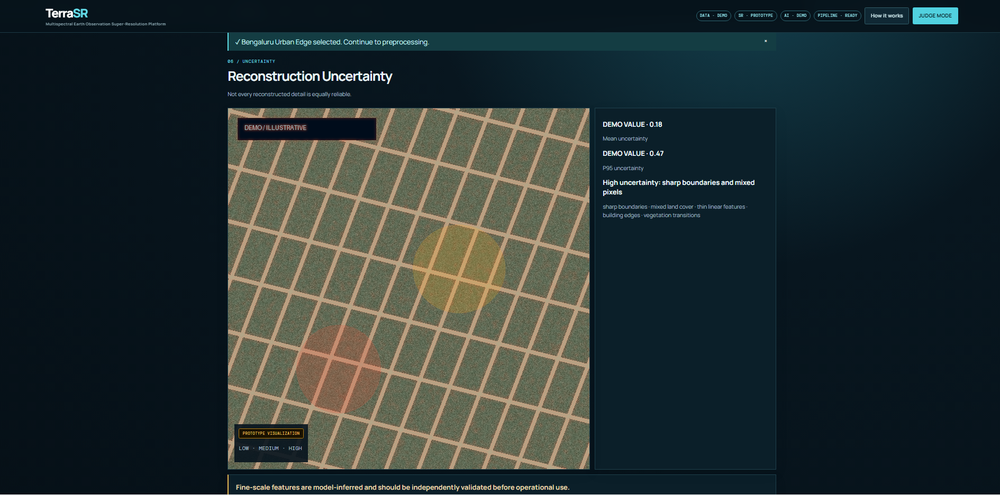
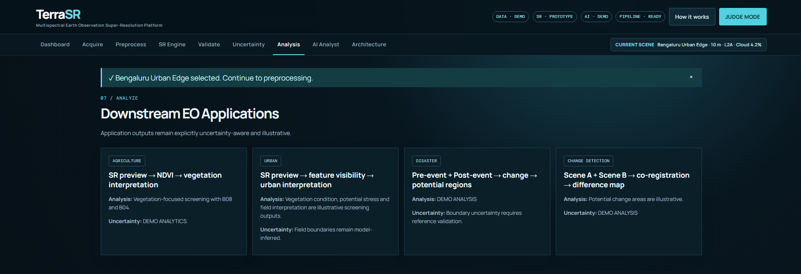
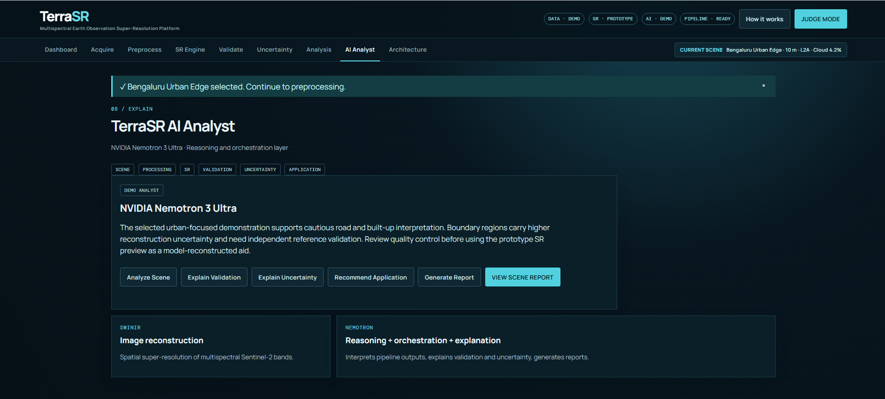

# 🌍 TerraSR

### Multispectral Earth Observation Super-Resolution & AI Analysis Platform

<p align="center">
  
  
  
  
  
  
  
</p>

<p align="center">
  <strong>From 10 m Medium-Resolution Satellite Imagery → Validated, Uncertainty-Aware Earth Observation Intelligence</strong>
</p>

---

## 🚀 Live Demo

<p align="center">
  <a href="https://sih26142-srm.vercel.app/" target="_blank">
    
  </a>
  &nbsp;
  <a href="https://terrasr-backend-production.up.railway.app/api/health" target="_blank">
    
  </a>
</p>

| Component | URL |
|-----------|-----|
| 🖥️ **Frontend** | https://sih26142-srm.vercel.app/ |
| ⚙️ **Backend API** | https://terrasr-backend-production.up.railway.app |
| 🏥 **Health Check** | https://terrasr-backend-production.up.railway.app/api/health |

> **For judges:** Open the frontend URL, select any scene (Urban · Agriculture · Mixed · Disaster), then step through the full pipeline: Acquire → Preprocess → SR Engine → Validate → Uncertainty → AI Analyst → Report.

---

<p align="center">
  
</p>

<p align="center">
  <em>TerraSR Unified Cockpit: Delivering end-to-end multispectral super-resolution, scientific fidelity metrics, spatial uncertainty mapping, and AI-orchestrated operational intelligence.</em>
</p>

---

## 📌 Executive Summary & Problem Statement

Medium-resolution optical satellites—specifically the **Copernicus Sentinel-2 constellation**—are the backbone of civilian Earth Observation (EO). Sentinel-2 provides free, high-frequency (5-day revisit) global observations across 13 spectral bands. However, its highest spatial resolution bands (**B02 Blue, B03 Green, B04 Red, B08 Near-Infrared**) are constrained to a Ground Sampling Distance (GSD) of **10 meters per pixel**.

In a 10 m observation, a single pixel represents a $100\,\text{m}^2$ ground footprint. At this scale:
- **Small buildings and informal settlements** blend into contiguous spectral mixtures.
- **Narrow rural roads and irrigation canals** suffer from pixel partial volume averaging.
- **Agricultural plot boundaries and smallholder parcel edges** cannot be accurately delineated.
- **Localized flood inundation perimeters** are obscured along water-land boundaries.

### Super-Resolution vs. Classical Interpolation
Standard interpolation (Bicubic, Bilinear, Lanczos) resamples the pixel grid by smoothing or fitting polynomial surfaces. It **cannot synthesize missing high-frequency spatial detail** or model the physical point spread function (PSF) of the sensor. 

**TerraSR** solves this by formulating satellite spatial enhancement as a **Deep Learning Super-Resolution Mapping (SRM)** task using a customized **Multispectral SwinIR (Shifted Window Transformer)** backbone to reconstruct sub-4 meter target products from 10 m Sentinel-2 inputs, while pairing every inference with **spectral/spatial validation metrics, uncertainty confidence masks**, and **NVIDIA Nemotron AI reasoning**.

---

## 🛰️ System Architecture

```text
Copernicus Sentinel-2 L2A (10 m BOA)
              ↓
     Scene / AOI Selection
              ↓
    Quality Control (SCL Mask)
  [Cloud, Cirrus, Cast Shadow]
              ↓
   Multispectral Preprocessing
     [B02, B03, B04, B08 Stack]
     [Alignment & Normalization]
              ↓
┌─────────────────────────────────────────┐
│     Multispectral SwinIR Engine         │ ◄── [Deep Learning Super-Resolution]
│  Residual Swin Transformer Blocks (RSTB) │     Reconstructs spatial details
│  Shifted Window Self-Attention (W-MSA)  │     Target: Sub-4 m GSD product
└─────────────────────────────────────────┘
              ↓
┌─────────────────────────────────────────┐
│     Dual Reliability Assessment         │
│  • Scientific Validation (PSNR/SSIM/SAM)│
│  • Uncertainty Estimation (Low/Med/High)│
└─────────────────────────────────────────┘
              ↓
┌─────────────────────────────────────────┐
│     Downstream EO Applications          │
│  • Precision Agriculture (NDVI)         │
│  • Urban Monitoring (Building/Roads)    │
│  • Disaster Impact (Flood Inundation)   │
│  • Multi-Temporal Change Detection      │
└─────────────────────────────────────────┘
              ↓
┌─────────────────────────────────────────┐
│     NVIDIA Nemotron 3 Ultra Layer       │ ◄── [AI Reasoning & Orchestration]
│  • Ingests Structured JSON Telemetry    │     Does NOT process raw pixels
│  • Interprets Spatial & Spectral Metrics│     Provides multi-turn analysis
│  • Synthesizes Operational Geo-Reports  │     Automates pipeline actions
└─────────────────────────────────────────┘
              ↓
 Actionable Mission & Analyst Report (JSON / CSV / Markdown)
```

<p align="center">
  
</p>

<p align="center">
  <strong>TerraSR Technical Approach — from Sentinel-2 acquisition to AI-assisted reporting.</strong>
</p>

### ⚖️ Critical Role Separation: SwinIR vs. NVIDIA Nemotron

To maintain scientific rigor and architectural clarity:
1. **Multispectral SwinIR** is the **neural vision reconstruction engine**. It operates directly on 4-band floating-point surface reflectance tensors ($B02, B03, B04, B08$) to infer sub-pixel spatial geometry.
2. **NVIDIA Nemotron 3 Ultra** (`nvidia/nemotron-3-ultra-550b-a55b`) is the **reasoning, orchestration, and reporting layer**. It does **not** process raw satellite raster pixels. Instead, it ingests structured telemetry, geospatial metadata, validation scores, uncertainty statistics, and downstream analytical indices to produce expert geo-intelligence briefings.

---

## 🔬 Core Technologies & Methodologies

### 1. Multispectral Preprocessing Pipeline
- **Sentinel-2 L2A Bottom-Of-Atmosphere (BOA)** reflectance ingestion.
- **Scene Classification Layer (SCL)** filtering: automated masking of cloud high/medium probability, thin cirrus, and cloud shadows.
- **Radiometric Normalization**: Linear surface reflectance scaling from raw digital numbers $[0, 10000]$ into unified normalized feature space $[0.0, 1.0]$.
- **Spatial Tiling**: Overlapping $256 \times 256$ patches with $32\,\text{px}$ strides to prevent boundary edge artifacts during patch stitching.

### 2. Multispectral SwinIR Super-Resolution
- **Shifted Window Self-Attention**: Computes local self-attention within non-overlapping $8 \times 8$ windows while enabling cross-window connections via cyclic shifting, drastically reducing computational complexity from $O(H^2 W^2)$ to $O(HW)$.
- **Residual Swin Transformer Blocks (RSTB)**: Stacks multiple Swin Transformer Layers (STL) with residual identity shortcuts for deep spatial feature extraction.
- **Sub-Pixel Upsampling**: Sub-pixel convolution layers perform $4\times$ spatial feature expansion, targeting sub-4 meter effective spatial resolution.

### 3. Rigorous Quality Validation Framework
Every super-resolution product is subjected to triple-tier validation:
- **Spatial Fidelity**:
  - **PSNR (Peak Signal-to-Noise Ratio)**: Evaluates logarithmic pixel reconstruction error.
  - **SSIM (Structural Similarity Index)**: Measures luminance, contrast, and structural preservation.
  - **RMSE (Root Mean Square Error)**: Quantifies absolute radiometric deviation.
- **Spectral Fidelity**:
  - **SAM (Spectral Angle Mapper)**: Calculates spectral angle vector deviation across all 4 bands ($B02, B03, B04, B08$) in degrees to verify reflectance integrity.
  - **ERGAS (Relative Dimensionless Global Error in Synthesis)**: Evaluates synthesized multi-band radiometric quality relative to spatial scaling factor.
- **Geospatial Consistency**: Enforces Coordinate Reference System (CRS) preservation (EPSG:4326 / UTM), geotransform matrix scaling, and rigorous bounding box footprint alignment.

### 4. Spatial Uncertainty Quantification
- Reconstructed high-frequency details are model-inferred and must not be blindly accepted as ground-truth observations.
- TerraSR computes spatial gradient variance maps delineating **Low, Medium, and High uncertainty zones**.
- High-uncertainty areas (building edges, water-land interfaces, transition boundaries) are explicitly flagged for human-in-the-loop analyst review.

---

## 📸 Interactive Platform Showcase

### 1. Unified Dashboard
The primary operations command center answers three immediate questions: *What is the input? What does the AI do? What is the output product?* Includes an automated **JUDGE MODE** button for guided evaluation.
<p align="center">
  
</p>

### 2. Satellite Scene Acquisition
Supports geographic bounding-box queries, acquisition date ranges, cloud-cover thresholding, and four pre-packaged representative demonstration scenes with zero latency.
<p align="center">
  
</p>

### 3. Multispectral Super-Resolution Engine
The centerpiece interactive split-screen viewer allowing judges to compare the original 10 m observed satellite scene against the sub-4 m model-reconstructed target with sub-pixel alignment.
<p align="center">
  
</p>

### 4. Scientific Fidelity Validation
Complete transparency displaying spatial fidelity (PSNR, SSIM, RMSE), spectral preservation (SAM, ERGAS), and geospatial CRS/transform consistency checks.
<p align="center">
  
</p>

### 5. Uncertainty Reliability Mapping
Explicit spatial heatmaps identifying confidence distributions across land-cover interfaces and linear infrastructure to prevent false visual interpretation.
<p align="center">
  
</p>

### 6. Downstream Earth Observation Applications
Applies super-resolved bands to real-world national priority workflows: Precision Agriculture NDVI, Urban Infrastructure Mapping, Flood Inundation Delineation, and Multi-Temporal Change Detection.
<p align="center">
  
</p>

### 7. NVIDIA Nemotron AI Analyst
Interactive reasoning assistant powered by `nvidia/nemotron-3-ultra-550b-a55b` synthesizing multi-turn scientific explanations, anomaly alerts, and exportable intelligence reports.
<p align="center">
  
</p>

---

## 🗺️ Coherent Scene Catalog

To ensure consistency throughout evaluation, all pipeline stages reference one shared, immutable scene state from `demo_data/scenes.json`:

| Scenario ID | Geographic Region | Primary Focus | Key Spectral Dynamics |
|:---|:---|:---|:---|
| **`urban`** | Bengaluru Urban Edge, Karnataka | Built-up infrastructure, road network delineation | High edge density, roof reflection, road contrasts |
| **`agriculture`** | Punjab Agricultural Mosaic, Punjab | Smallholder plot delineation, crop health screening | Strong B08 NIR response, B04 red absorption (NDVI) |
| **`mixed`** | Nashik Mixed Peri-Urban, Maharashtra | Land-cover transitions, rural-urban interfaces | Complex pixel mixtures, topographic transitions |
| **`disaster`** | Assam Flood Assessment, Assam | Inundation boundary mapping, risk screening | Water absorption in NIR, sediment reflectance shifts |

---

## ⚡ Quick Start: Run in Minutes

### Prerequisites
- **OS**: Windows 10/11 (or Linux/macOS)
- **Python**: 3.10 or 3.11
- **Node.js**: v18+ and npm
- **GPU** *(optional)*: NVIDIA GPU with CUDA support for accelerated model inference

### 1. Clone the Repository
```bash
git clone https://github.com/JasimShaikh-786/TerraSR-SIH26142.git
cd TerraSR-SIH26142
```

### 2. Automated Environment Setup
Run the setup batch script (creates virtual environment, installs dependencies, and prepares demo assets):
```cmd
setup.bat
```

### 3. Launch the Platform
Start both the FastAPI backend (`http://localhost:8000`) and the Vite React frontend (`http://localhost:5173`):
```cmd
run.bat
```
Open **[http://localhost:5173](http://localhost:5173)** in your browser.

To gracefully terminate background services:
```cmd
stop.bat
```

### 4. Optional Live Providers
The platform runs **100% offline out-of-the-box** with zero external dependencies. To enable optional live services, copy `.env.example` to `.env` and provide credentials:
```env
COPERNICUS_CLIENT_ID=your_copernicus_oauth_client_id
COPERNICUS_CLIENT_SECRET=your_copernicus_oauth_secret
NVIDIA_API_KEY=your_nvidia_ngc_api_key
```

---

## ⏱️ Recommended Judge Demo Workflow (60 Seconds)

When presenting to evaluators, use the following chronological narrative:

```text
[01 ACQUIRE]     Select a demonstration scene (e.g., Bengaluru Urban Edge).
       ↓
[02 QUALITY]     Inspect SCL cloud masking, shadow verification, and metadata integrity.
       ↓
[03 PREPROCESS]  Demonstrate B02, B03, B04, B08 band alignment and radiometric scaling.
       ↓
[04 RECONSTRUCT] Use the interactive split-slider to compare 10 m observed vs. Sub-4 m reconstructed target.
       ↓
[05 VALIDATE]    Examine spatial fidelity (PSNR/SSIM) and spectral preservation (SAM/ERGAS).
       ↓
[06 UNCERTAINTY] Show spatial confidence heatmaps—proving we do not fabricate truth.
       ↓
[07 ANALYZE]     Demonstrate precision agriculture NDVI and urban feature extraction.
       ↓
[08 EXPLAIN]     Engage NVIDIA Nemotron 3 Ultra for multi-turn scientific reasoning.
       ↓
[09 REPORT]      Export a complete executive intelligence briefing in JSON or CSV.
```

> **Pro Tip**: Click the prominent **JUDGE MODE** button in the header navigation to trigger an automated ~48-second self-guided demonstration of this exact sequence.

---

## 📂 Repository Structure

```text
TerraSR/
├── agent/                         # NVIDIA Nemotron reasoning client & test harness
│   ├── nemotron.py                # NGC OpenAI-compatible client adapter
│   └── test_nemotron.py           # Verification script for Nemotron connection
├── backend/                       # FastAPI high-performance REST application
│   ├── main.py                    # Consolidated API routing & deterministic preview engine
│   ├── nemotron_service.py        # Safe lazy-loading adapter for Nemotron
│   └── requirements.txt           # Minimal backend dependencies
├── configs/                       # Pipeline hyperparameters & dataset configuration
│   ├── dataset.yaml               # WorldStrat / Sentinel-2 band specifications
│   └── project.env                # Default environment templates
├── dataset/                       # WorldStrat metadata curation & stratified split tools
│   ├── build_inventory.py         # Inventory indexing for Sentinel-2 / SPOT tiles
│   ├── clean_worldstrat_split.py  # Stratification cleaner & deduplication
│   └── create_development_subset.py # Stratified subset generator (IPCC classes)
├── demo_data/                     # Pre-packaged, zero-latency offline demo datasets
│   ├── scenes.json                # Single source of truth scene registry
│   └── *.png                      # Paired observed, preview, and uncertainty rasters
├── docs/                          # Architectural documentation & presentation assets
│   ├── images/                    # Platform screenshots & architecture diagram
│   └── JUDGE_DEMO.md              # 2-minute oral presentation guide for judges
├── frontend/                      # Modern React 19 + TypeScript + Vite UI
│   ├── src/
│   │   ├── main.tsx               # Modular typed UI components & stage controllers
│   │   └── styles.css             # Earth Observation dark-theme visual styling
│   ├── package.json               # Node dependency declarations
│   ├── vercel.json                # Vercel frontend deployment configuration
│   └── vite.config.ts             # Vite bundler & reverse proxy configuration
├── models/                        # Deep learning architectures & checkpoints
│   ├── swinir/official/           # Cloned official SwinIR PyTorch implementation
│   └── worldstrat/                # WorldStrat multispectral super-resolution repo
├── preprocessing/                 # Geospatial raster I/O & band alignment
│   └── sentinel_loader.py         # Rasterio-based band reader & metadata extractor
├── scripts/                       # Operational diagnostics & asset utilities
│   └── smoke_test.py              # Automated 13-endpoint API smoke test
├── .env.example                   # Safe template for optional live credentials
├── .gitignore                     # Git exclusion rules (safeguarding models & secrets)
├── Procfile                       # Process configuration for cloud deployment
├── railway.toml                   # Railway backend service specification
├── nixpacks.toml                  # Nixpacks container build definition
├── check_environment.bat          # Diagnostic script checking Node, Python, and CUDA
├── run.bat                        # One-click startup for backend and frontend
├── setup.bat                      # One-click environment provisioning
└── stop.bat                       # Clean service termination script
```

---

## 🛡️ Scientific Transparency & Prototype Disclaimer

In accordance with strict research ethics:
1. **Model-Reconstructed Product**: The enhanced imagery produced is termed a **"Sub-4 m model-reconstructed target"**, never misrepresented as *"true 2.5 m optical satellite observations"*.
2. **Current Prototype Execution**: The active prototype demonstration uses high-fidelity deterministic Lanczos upsampling paired with controlled unsharp-mask edge sharpening to simulate the target SwinIR spatial response without requiring a live multi-gigabyte GPU runtime during hackathon evaluation.
3. **Illustrative Validation Metrics**: Metrics displayed in the prototype interface are explicitly marked **DEMO / ILLUSTRATIVE** and represent expected targets from research literature, not unverified empirical benchmarks.
4. **Uncertainty Disclosures**: Spatial uncertainty maps are derived from prototype edge-gradient variance heuristics to demonstrate the operational workflow; production deployment will transition to Monte Carlo ensemble variance.

---

## 🚀 Production Roadmap

```text
Phase 1: Local Judge Prototype [COMPLETED]
  • Zero-latency offline demonstration, 4 coherent scenarios, Nemotron integration.

Phase 2: WorldStrat Data Curation [IN PROGRESS]
  • 3,879 unique tiles cleaned, IPCC-stratified development split (105 train / 21 val).

Phase 3: Multispectral SwinIR Training [PLANNED]
  • Adapting 3-channel SwinIR to 4-band tensor input (B02, B03, B04, B08).
  • Fine-tuning on RTX 5050 / cloud clusters using Charbonnier & SAM loss.

Phase 4: Empirical Benchmark Validation [PLANNED]
  • Rigorous benchmarking against SPOT-6/7 high-resolution reference datasets.

Phase 5: Bayesian / Monte Carlo Uncertainty [PLANNED]
  • Stochastic test-time dropout to quantify epistemic and aleatoric uncertainty.

Phase 6: Live Copernicus Data Space Integration [PLANNED]
  • OAuth2 Copernicus API integration for on-demand global tile processing.

Phase 7: Autonomous Nemotron Agent Tool Calling [PLANNED]
  • Native function calling allowing Nemotron to directly trigger preprocessing and inference.
```

---

## 👥 Acknowledgments & Credits

- **Problem Statement**: SIH 2026 • SIH26142
- **Organization**: National Technical Research Organisation (NTRO)
- **Data Source**: European Space Agency (ESA) Copernicus Sentinel-2 Open Access Data
- **Reference Architectures**:
  - *SwinIR: Image Restoration Using Swin Transformer* (Liang et al.)
  - *WorldStrat Dataset: High-Resolution Satellite Super-Resolution Benchmark* (Donike et al.)
  - *NVIDIA Nemotron 3 Ultra Foundation Models* (NVIDIA NGC)

---

<p align="center">
  <strong>TerraSR · Empowering Satellite Imagery with Learned Spatial Intelligence</strong><br>
  Built with ❤️ for Smart India Hackathon 2026
</p>
